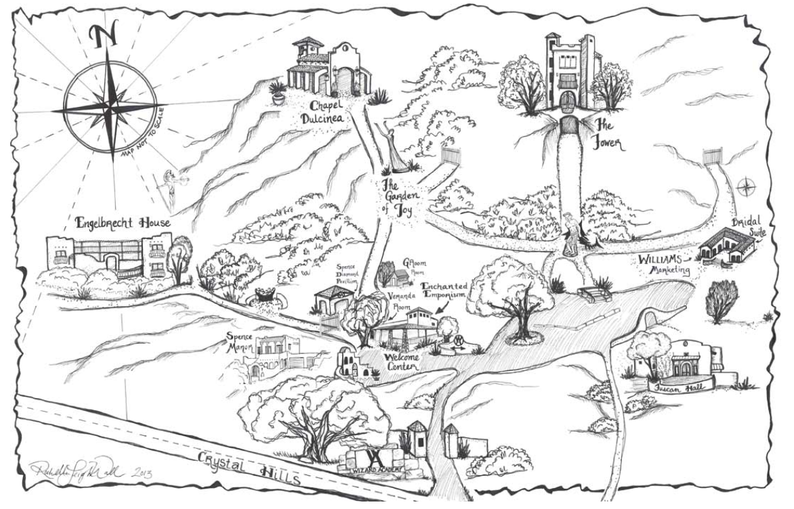

# We're so excited for you to join us on our special day!

This website will be your best resource for any and all things wedding-related. If you have any additional questions, text Hailey!

### Quick FAQs
- Who? You! Plus ones (if given) have been indicated on your invitation.
- When? Monday, June 16th 2025 at 4pm CT
- Where? The ceremony will be held at Chapel Dulcinea, located at 16221 Crystal Hills Dr. in Austin, TX. The reception will be just down the street at Fall Creek Vineyards - Driftwood, located at 18059 FM 1826 in Driftwood, TX.
- Dress code? Please wear your best semi-formal or dressy casual attire. Bonus points for summery colors or florals!

### RSVP
Please RSVP at the link by Monday, May 19th 2025 at 10pm CT: https://forms.gle/waY7nQdkGuUfCC16A

# Ceremony
Our ceremony venue is at Chapel Dulcinea, a beautiful outdoor chapel overlooking the limestone bluffs of the Texas Hill Country. The chapel is located on the Wizard Academy campus, an ecclectic business school for aspiring entrepeneurs. Here's what you need to know:

- The chapel is covered to provide some shade/shelter
- We'll be providing waters to help keep cool
- Free parking, with two lots to choose from, a few minutes walk from the chapel
- Onsite bathrooms will be available for the duration of the event
- Open seating! No need to pick a side, you're all loved by the groom and the bride <3

For pictures of the venue, you can visit their site here: https://chapeldulcinea.org/

### Venue Map

### Road Directions to Chapel Dulcinea
The easiest way to navigate to the venue is to search 'Chapel Dulcinea' on Apple or Google Maps. The address is:
16221 Crystal Hills Dr
Austin, TX 78737

Directions from central Austin:
1. Take MoPac (Loop 1) South till it becomes 45
2. Continue on 45 to FM 1826
3. Turn LEFT on FM 1826 and go just over 4 miles
4. Turn LEFT on Crystal Hills Drive and go 1/2 mile up the hill
5. Turn LEFT at the Wizard Academy Entrance

Directions from I-35
1. Take I-35 to Buda exit #221/Main St. (old Loop 4)
2. Go WEST on Main St. (old Loop 4.) almost 1 and 1/2 miles to “downtown” Buda
3. Turn WEST on FM 967 (toward Camp Ben McCulloch) and go 12 miles
4. Turn RIGHT on FM 1826 and go almost 3 miles
5. Turn RIGHT on Crystal Hills Drive and go 1/2 mile up the hill
6. Turn LEFT at the Wizard Academy Entrance

Directions from Highway 290
1. Take Highway 290 to FM 1826
south of Oak Hill, north of Dripping Springs
2. Turn onto FM 1826 and go approx. 8 miles
3. Turn LEFT on Crystal Hills Drive and go 1/2 mile up the hill
4. Turn LEFT at the Wizard Academy Entrance
 
Directions from the Airport: (As you’re driving, keep in mind that Highway 71, Highway 290 and Ben White Blvd. are all the same road.)
1. Head west (LEFT) on highway 71
2. go underneath IH 35 and continue west on 71/Ben White towards US290 west, but before you get to US290
3. Turn south (LEFT) on Loop 1 (MoPac) and
4. Continue until it becomes Highway 45 and then intersects with FM 1826
5. Turn LEFT on FM 1826 and continue for just over 4 miles.
6. Turn LEFT on Crystal Hills Drive and go 1/2 mile up the hill
7. Turn LEFT at the Wizard Academy Entrance

# Reception
After the ceremony, a short reception will be held at Fall Creek Vineyards - Driftwood. Some things to note:

- We have a private indoor event room and outdoor courtyard from 5-7pm for dinner and dancing!
- We'll be catering Torchy's Tacos, with meat and veggie options available
- Partially open bar, serving up some of the best Texas-made wines
- Free parking and onsite bathrooms will be available
- & don't forget to save room for some cake!

For information about the reception venue, you can find them here: https://fcv.com/

If there are any allergies, please make Hailey aware of them ASAP!

### Road Directions to Fall Creek Vineyards
Again, the easiest way to navigate to the reception is to search 'Fall Creek Vineyards - Driftwood' on Apple or Google Maps, and it should be about 8 minutes to drive. Their address is:
18059 FM 1826
Driftwood, TX 78619

Directions from Chapel Dulcinea:
1. Turn RIGHT on Crystal Hills Drive and go 1/2 mile down the hill
2. Turn LEFT on FM 1826 and continue for about 3 miles
3. Turn LEFT into Fall Creek Vineyards - Driftwood (note that this will be a very sharp turn just before Salt Lick BBQ)

# Timeline
To be announced! We are currently planning for the ceremony to begin at 4pm.

# Attire
We would love for our guests to wear their best summery, semi-formal attire! Austin’s June temperatures typically reach upwards of 93°F, and while the ceremony will be in the shade, we want everyone to stay cool and comfortable. We recommend wearing lightweight, breathable fabrics to beat the heat. For outfit inspiration, feel free to use this guide:

# Registry
Your presence at our wedding is the greatest gift we could ask for! If you would like to honor the next chapter of our lives with a gift, we have registered with Amazon. You can search 'Hailey Schmidt' on Amazon's Find a Registry tool, or follow this link for some gifting inspiration: https://www.amazon.com/wedding/share/MelzowWedding

